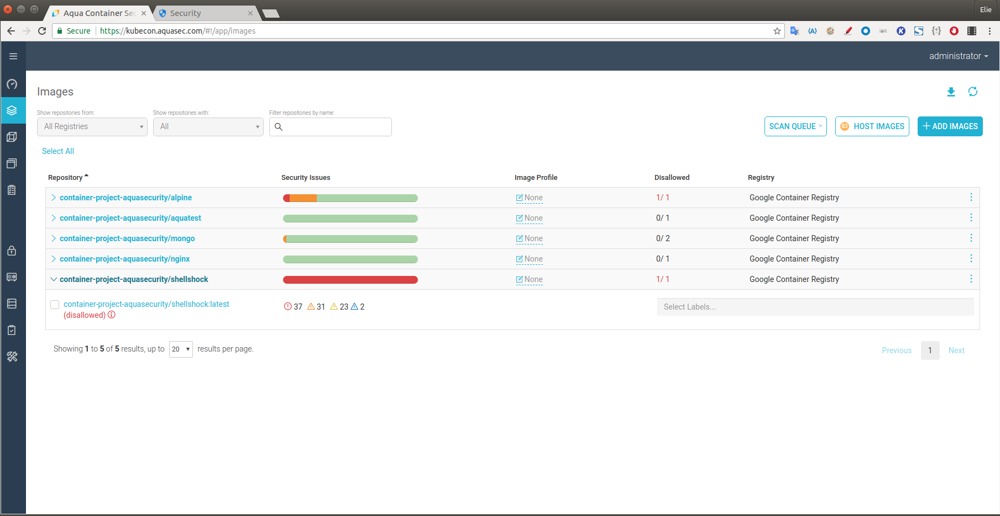

# markdown-musings

github/markdown musings

A. include an image in md files.

The image is stored in github, and referenced by the md file. Note, if the md file is opened in a local repo, you won't see the image.

1. upload the image to github.
2. add the image in the md file with this syntax (this uses relative addressing in the URL).

B. branch the code.

this is the main branch.

C. 
